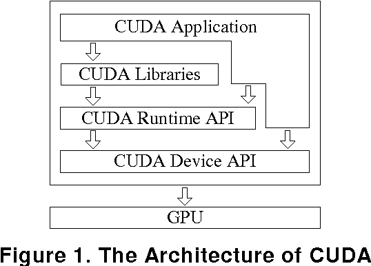
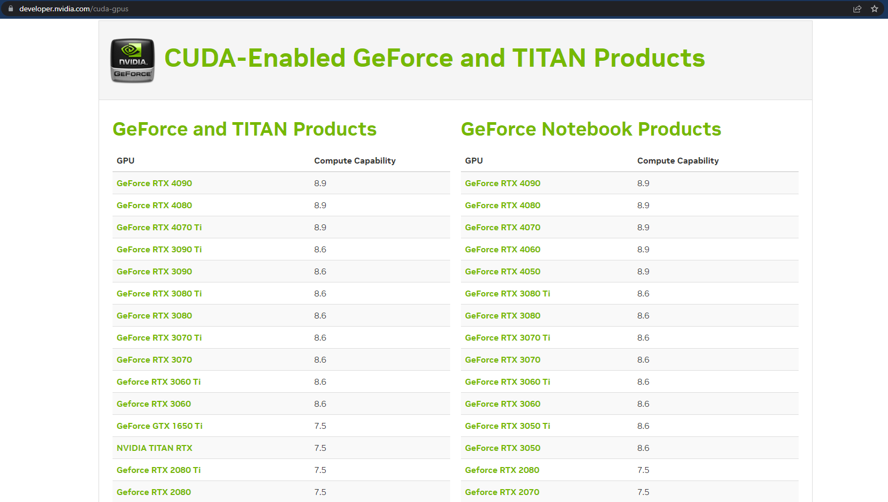
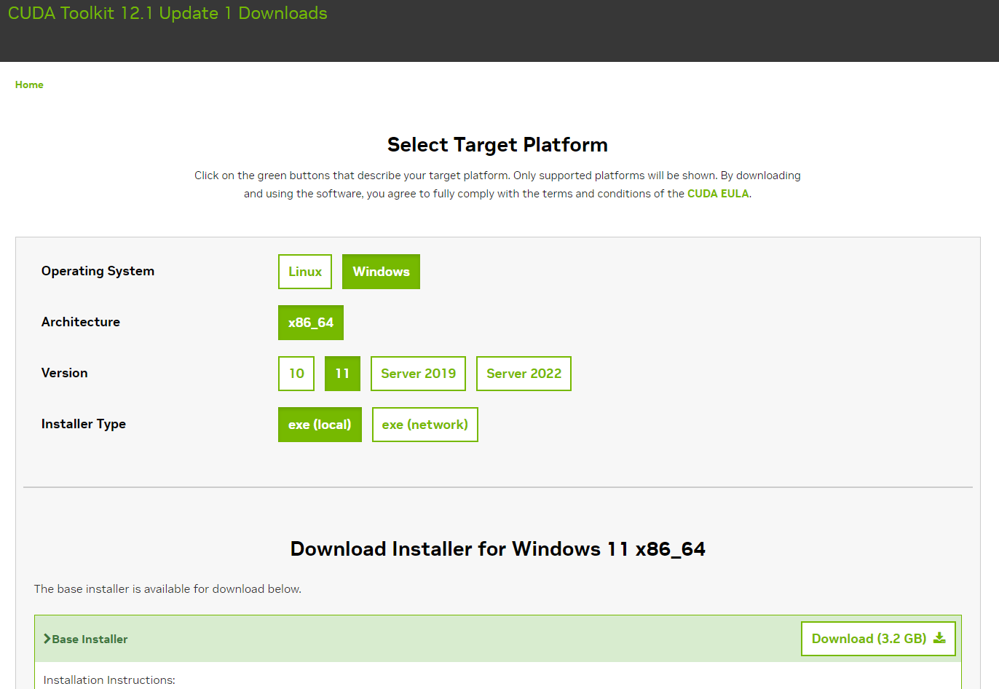
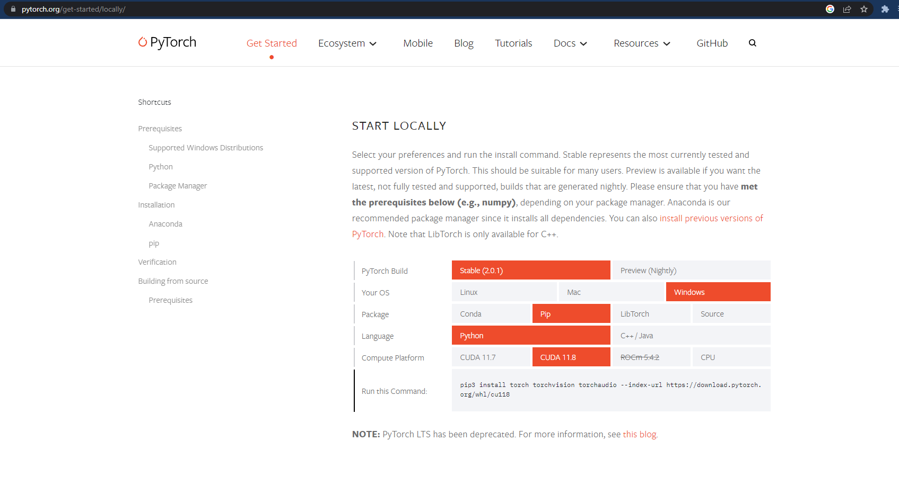

## **Guide To Install CUDA for GPU enabled Deep Learning with PyTorch**
CUDA & PyTorch Configuration on Windows 10+

---


`Experiments were run on a Windows 11 machine with a 12GB GeForce RTX 3060 GPU, 32 GB RAM, and an i7 10th generation CPU.`

You will need:
- A CUDA-capable NVIDIA GPU
- A supported version of Microsoft Visual Studio
- Python distribution (like anaconda)

Finished Links:
- [Github](https://github.com/mo-justlearnai/Guide-To-Install-CUDA-for-GPU-enabled-Deep-Learning-with-PyTorch)

## **What is CUDA?** 

NVIDIA definition of CUDA : 

```
CUDA is a parallel computing platform and programming model created by NVIDIA. With more than 20 million downloads to date, CUDA helps developers speed up their applications by harnessing the power of GPU accelerators. 
```

CUDA is like an API to allow your computer to access the CUDA cores on your NVIDIA GPU which perform parallel computing.  



A CUDA core is like a CPU core, being the central part of the processing unit that performs calculations and operations on data sent to it. 

The GPU I will be using for this tutorial as stated above is a 12GB GeForce RTX 3060 NVIDIA GPU that has 2584 CUDA Cores.

### **1. Verify the system has a CUDA-capable GPU**

First, we need to check that you have a CUDA compatible GPU. 

As of May 2023, the CUDA API is still limited to NVIDIA hardware so AMD, ASUS, MSI GPUs won’t work with CUDA. 

Check your NIVIDIA GPU Compute Capability.
Link: https://developer.nvidia.com/cuda-gpus



`Note: The compute capability version does not matter.  `


### **2. Install CUDA Toolkit**
Link: https://developer.nvidia.com/cuda-downloads

Follow the download procedure

Note: From my knowledge downloading either the **local** or **network** versions will work. The difference is between exe(local) and exe(network) is stated below in the NVIDIA docs. 

```
When installing CUDA on Windows, you can choose between the Network Installer and the Local Installer. The Network Installer allows you to download only the files you need. The Local Installer is a stand-alone installer with a large initial download.
```

Network Installer: A minimal installer which later downloads packages required for installation. Only the packages selected during the selection phase of the installer are downloaded. This installer is useful for users who want to minimize download time.

Local Installer: An installer which contains all the components of the CUDA Toolkit and does not require any further download. This installer is useful for systems which lack network access and for enterprise deployment.

Reference: https://docs.nvidia.com/cuda/cuda-quick-start-guide/

I chose the local installer so no further downloads will be required. 



### **3.Installing using default configuration**

Follow the default configuration to install the toolkit. 

Note: Some older versions of the CUDA toolkit don't add CUDA to the environment variables PATH. But for me version 12.1 did. 

### **4.Copy PyTorch CUDA install command**
Link: https://pytorch.org/get-started/locally/



`pip install torch torchvision torchaudio --extra-index-url https://download.pytorch.org/whl/cu118`

**CU118** stands for CUDA Toolkit 11.8.  But we installed CUDA Toolkit 12.1?

I had the same questions when CUDA 12.1 was released in April 2023 but it works just fine with PyTorch. You will see by following to the end of this article. 

**Run the above command in a (anaconda) virtual environment.**

### **5.Run the below in a .py or .ipynb file**

a. Create a file 'gpucheck.py' 

b. Copy and paste the below code into 'gpucheck.py'

c. Run: `python gpucheck.py` from the command line or run the code in a notebook. 

```python
# VENV name: cudaconfig
import torch

print("CUDA is available: ", torch.cuda.is_available())
# True

print("Number of CUDA devices: ", torch.cuda.device_count())
# 5

print("CUDA current device: ", torch.cuda.current_device())
# 0

print("CUDA device name: ", torch.cuda.get_device_name(0))
# 'NVIDIA GeForce RTX 3060'
```

Thanks for reading.

---
<!-- DONE -->